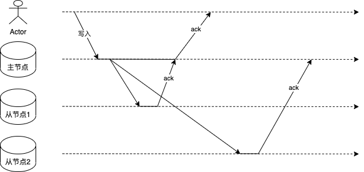

# 主从架构

在集群中会有多个包含完整数据几的节点，称之为副本。

要保证多个数据副本之间的数据一致性，常用的一种做法就是主从复制，如GFS，HDFS都是采用主从复制的方式。

在主从架构中集群中节点主要分为两类

- master：主节点，处理客户端的读写请求。
- slave：从节点，通常只处理客户端的读请求，以及主节点的写请求，可以理解为对于客户端而言从节点上是数据的只读副本。

## 主从复制

主从复制的具体实现方式主要有两种，两种复制方式在性能和一致性方面存在差异

- 同步复制

  主节点写入之后同步向从节点1发起复制请求，主节点等待从节点返回值后才向客户端返回。

- 异步复制

  主节点写入之后异步向从节点2发起复制请求，主节点不需要等待从节点2的ack，也可以给客户端返回。

### 复制滞后带来的问题

- 读自己的写

- 单调读

- 前缀一致读

