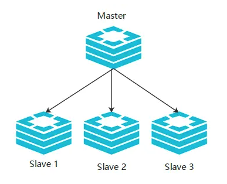
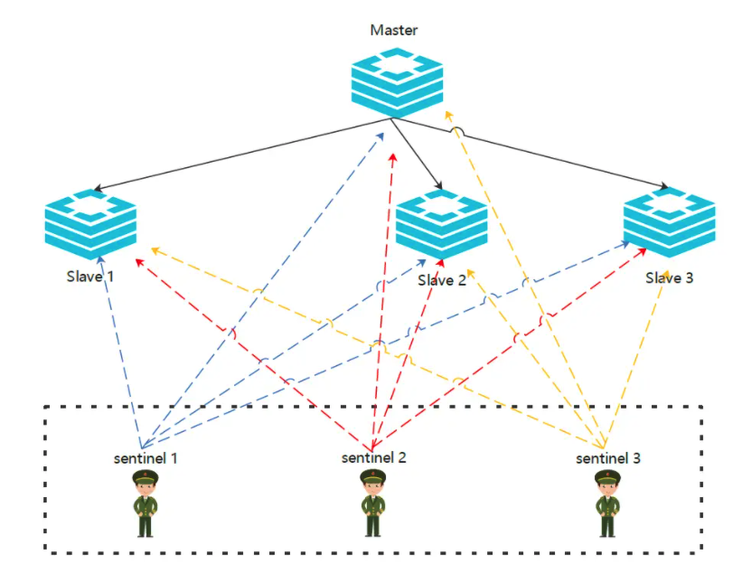

## Master-Slave架构

多机器部署，通过副本机制提供高可用。一台redis中的数据发生变化自动同步到其他机器上。

在Master-Slave架构中，讲redis节点分为两类，master节点和slave节点，master节点可以进行读写操作，slave节点只读。



需要手动设置slave节点

1. slave节点的配置redis.conf中设置

   ```conf
   slaveof [ip] [port]
   slave-read-only yes
   masterauth [passwd]
   ```

2. slave节点启动命令中设置 --slaveof 

3. redis-cli中设置：slaveof XXXX

Master节点崩溃后业务要手动进行切换，这点非常的不友好。

## 哨兵模式

master-salve的增强版本，在redis集群中新增哨兵角色，master节点宕机之后，哨兵会自动选举一个新的master节点。




## 集群模式

master-slave的架构使用副本的方式实现高可靠，在集群中存在数据冗余，集群模式不会存在冗余。

集群模式实现了Redis的分布式存储，对数据进行分片

