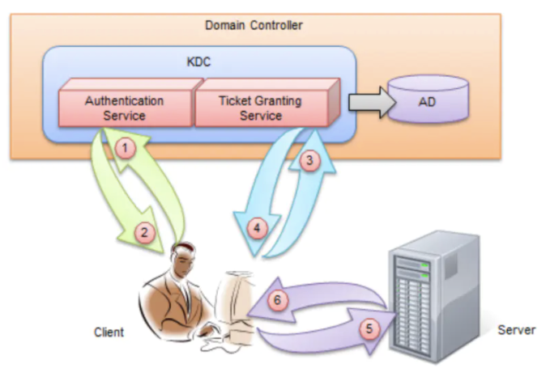
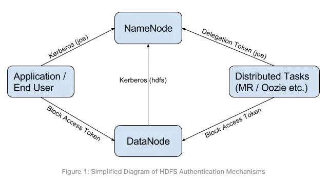

## Kerberos简介

Kerberos是在非安全网络中使用网络授权协议，Krb5是Kerberos协议的实现，有MIT开发并开源。MIT license，license友好。

MIT官网https://web.mit.edu/kerberos/krb5-latest/doc/

Kerberos名字取自于希腊神话中的三头犬，就像下面这兄弟（图片来自百度），两者的作用都一样，即：“看门”。至于它的三头分别代表了我们软件系统中的Clien、Server、KDC（Key Distribution Center，后面介绍它是干啥的）


关于Kerberos的认证原理介绍，



**Kerberos集群中的角色**

client：发起访问请求的端用户

Server：处理请求的服务器

KDC：Key Distributed Center

AS：认证服务器，进行用户认证，证明你就是你，认证OK之后会返回给客户端一个（TGT）

TGS：票据颁发服务器，你被证明就是你之后会给你颁发一个入场券（ST）

更加详细的材料可以参考外网上的帖子https://www.cnblogs.com/wukenaihe/p/3732141.html


Kerbeors认证的体系中有几个概念可以简述一下：

1. pricipal：认证的主体，也就是我们通常所说的“用户名”
2. [realm：中文翻译为“域”，在HDFS联邦架构中通常一个HDFS的namaspace就对应一个realm，形如：@ROOTCLOUD.COM](mailto:realm：中文翻译为“域”，在HDFS联邦架构中通常一个HDFS的namaspace就对应一个realm，形如：@ROOTCLOUD.COM)
3. keytab：由KDC颁发的某个principal的认证文件，里面保存有对应principal和密码信息（加密）
4. password：密码，人机账号就是认证时需要输入的密码口令；机机账号一般使用keytab来保存

## JDK对Kerberos的支持

代码可以使用com.sun.security.auth.module.Krb5LoginModule配置principal和Keytab

也可以通过JAAS文件进行注入，Kafka登录通过JAAS配置Kerberos的样例

```
KafkaClient{ com.sun.security.auth.module.Krb5LoginModule required #固定使用Krb5LoginModule 进行加载 keyTab="/usr/local/keytab/flink/flink.keytab" # keytab文件的绝对路径 principal="client/realm@rootcloud.COM" # principal useKeyTab=true useTicketCache=true; }; Client{ com.sun.security.auth.module.Krb5LoginModule required keyTab="/usr/local/keytab/flink/flink.keytab" principal="client/realm@rootcloud.COM" useKeyTab=true useTicketCache=true; }; KafkaServer{ com.sun.security.auth.module.Krb5LoginModule required keyTab="/usr/local/keytab/flink/flink.keytab" principal="server/realm@rootcloud.COM" useKeyTab=true useTicketCache=true; };
```

## Kerbeos在大数据组件中的应用

目前几乎所有apache生态的大数据组件都支持Kerbreos集成，如ZooKeeper、Hadoop、Spark、Flink等等。

尤其是Hadoop，对Kerberos的应用更是炉火纯青。为什么这么讲，从上面Kerberos认证授权的原理来看，在组件启用Kerberos认证之后，集群中每次HTTP/RPC请求理论上都是需要想KDC发出一次请求，这样容易让KDC服务成为集群中的访问热点，导致性能非常差。

为了避免这样的性能问题，Hadoop提供一个DT（Delegation Token）的方案，将相关的认证信息封装到DT中，通过Master分发到Slave总。这样在TGT的有效期内不需要在访问KDC进行认证授权。

有兴趣的同学可以参看Hadoop的源码Kerbero认证相关：org.apache.security.UserGroupInformation，简称UGI

DT：org.apache.hadoop.yarn.server.resourcemanager.webapp.dao.DelegationToken，简称DT




ZooKeeper配置Kerberos:

Hadoop配置Kerberos：在AUTH章节中，https://hadoop.apache.org/docs/stable/hadoop-auth/Configuration.html

Spark配置Kerberos：http://spark.apache.org/docs/latest/security.html#kerberos

Flink配置Kerberos：https://ci.apache.org/projects/flink/flink-docs-release-1.13/docs/deployment/security/security-kerberos/

Kafka配置Kerberos：http://kafka.apache.org/documentation/#security